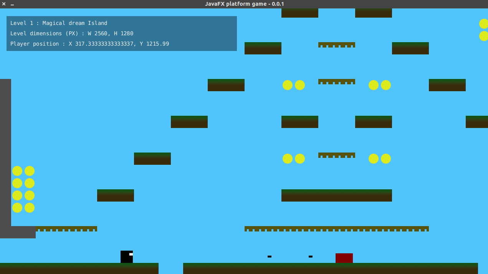

# JavaFX platform game

An orthogonal platform game example using JavaFX.

**This is a work in progress!**

This is developed and tested on a Linux-based system.  
I try to keep Win users into consideration when it comes to file separators but let me know if I missed something.

## Build & run

    // Run
    mvn clean javafx:run

    // Build
    mvn clean package
    
    // Run the build package
    java -jar target/javafx-platform-game-0.0.1-SNAPSHOT.jar 

## Map editor

This example uses [Tiled](https://www.mapeditor.org/) as a map editor which delivers a file format that is well-known by a large community.  
An added benefit is that there is a Java artifact libtiled available which seems well maintained for reading these maps.

We could write a custom map editor and file format but this seems pointless to me.  
Let's keep it fun and spend our time on creating the actual game itself.

## Graphics

The`_design-files` folder contains all source files which are created with [Inkscape](https://inkscape.org/) and [Gimp](https://www.gimp.org/).

All files will be designed in Inkscape and then exported to png files to create an image sprite with Gimp.

## Example

There's still a lot of things to be done and the example will grow in time with more functionality and hopefully better graphics as I brush up on my design skills a bit.   
For now there is just 1 level to try things out while developing entities and functionality so don't expect a score board yet.

You can play around a bit with the following key mappings.

* **LEFT/RIGHT** arrow keys to move left and right
* **UP** arrow key to jump
* **SPACE** to shoot

